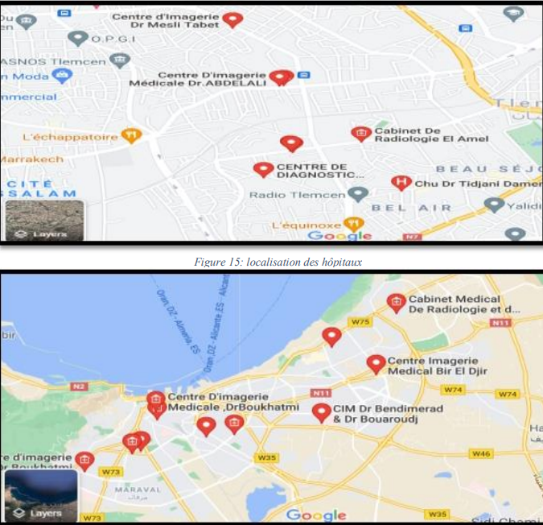
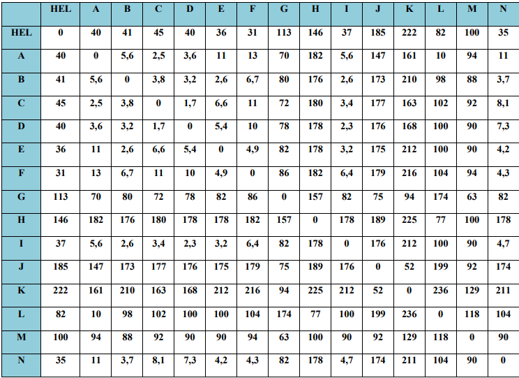

#  Helium Supply Chain Optimization  

  
  
  
  
  

---

##  Overview  

This project applies **industrial engineering and logistics optimization methods** to the real-world case of **HELIOS (Algeria)**, one of the world’s major helium producers.  

The goal is to **optimize the supply chain of helium exports from Algeria to Europe** by:  
1. Selecting the optimal export port using **AHP & TOPSIS**.  
2. Forecasting production and transport needs with **time-series models**.  
3. Optimizing local delivery routes using the **Traveling Salesman Problem (TSP)**.  

---

##  Project Structure  

```

helium-supply-chain-optimization/
│── data/                # Input datasets (production history, ports, clients, distances)
│── notebooks/           # Jupyter notebooks with analysis & simulations
│── src/                 # Python source code for models & solvers
│   ├── ahp.py           # AHP implementation
│   ├── topsis.py        # TOPSIS implementation
│   ├── forecast.py      # Forecasting models (Exponential Smoothing, etc.)
│   ├── tsp_solver.py    # Traveling Salesman Problem solver
│── results/             # Generated outputs (charts, reports, optimized routes)
│── README.md            # Project description
│── requirements.txt     # Python dependencies
│── LICENSE              # Open source license

````

---

##  Methods  

### 1. Port Selection  
- Multi-criteria decision analysis.  
- **AHP** to derive weights for criteria (distance, capacity, risks, docking priority, geography).  
- **TOPSIS** to rank alternatives.  

### 2. Production Forecasting  
- Time-series forecasting methods (e.g., **Exponential Smoothing**).  
- Forecasts annual production & truck trip requirements.  

### 3. Route Optimization  
- Modeled as a **Traveling Salesman Problem (TSP)**.  
- Solved with **Python OR-Tools** or **LINGO**.  
- Application: distribution to hospitals & industrial clients in West Algeria.  

---

##  Results (Example Simulation)  

- **Optimal Port**: Oran (best balance of distance & infrastructure).  
- **Forecast (2021–2025)**: +35% increase in helium shipments (~550 truckloads/year by 2025).  
- **Route Optimization**: 18% cost savings & 12% CO₂ reduction.  

---

##  Installation  

```bash
git clone https://github.com/username/helium-supply-chain-optimization.git
cd helium-supply-chain-optimization
pip install -r requirements.txt
````

---

##  Usage

Run AHP + TOPSIS for port selection:

```bash
python src/ahp.py
python src/topsis.py
```

Forecast production:

```bash
python src/forecast.py --data data/production.csv
```

Optimize local routes:

```bash
python src/tsp_solver.py --clients data/clients.csv
```

---


## Visuals

Here are some screenshots and visualizations from the Helium Supply Chain Optimization project:

### Problem Visualization


### Mathematical Model / Module


### Client Interface / Dashboard



##  License

This project is licensed under the **MIT License**. See the [LICENSE](LICENSE) file for details.

---

##  Contributions

Contributions are welcome! Please open an issue or submit a pull request.

---

```

